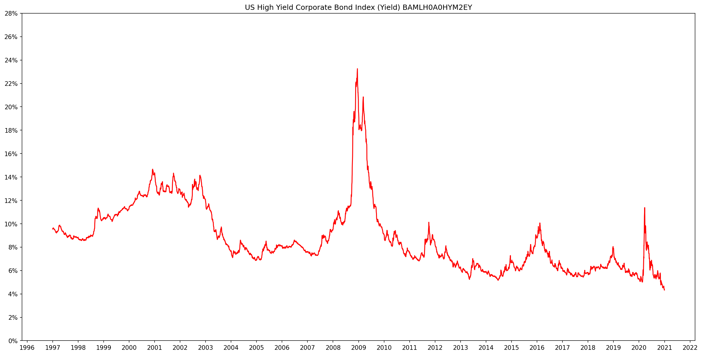
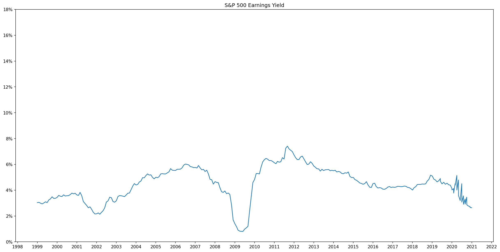

[Quandl](https://www.quandl.com/) is a marketplace for financial, economic and alternative data delivered in modern formats like JSON. This project creates visualizations from financial data obtained via Qaundl's API, with emphasis on fixed income markets. In addition to Quandl, I use Python, Pandas, Matplotlib to perform ETL and create visualizations. 

This repository includes a [Jupyter Notebook](https://github.com/AmitSamra/Bonds/blob/master/bonds.ipynb) that contains Python code to extract fixed income data from the [Quandl API](https://docs.quandl.com/docs/getting-started). The data is stored in JSON files contained in the [data](https://github.com/AmitSamra/Bonds/tree/master/data) folder. Pandas is used to load the JSON data to create dataframes, which form the basis for visualizations produced using Matplotlib. 

Let's begin with one of the most important fixed income securities in the world, the US 10 Year Treasury Note. This intermediate term bond serves as the reference point for many financial products, including other fixed income securities like Morgage Backed Securities and high yield debt. This chart shows that the 10YR rate has been declining persistently since the early 1990's. 

The Bank of America US High Yield Index is the defacto standard index for tracking the performance of US dollar denominated below investment grade rated corporate debt publicly issued in the US domestic market. As expected, high yield rates are significantly higher than US Treasuries and vary considerably over time. 

Likewise, there exists a similar index for emerging market debt, namely the Bank of America High Yield Emerging Markets Corporate Plus Index. The yields on these bonds are higher than US high yield bonds. 

Normally when we refer to stocks, the term Price-to-Earnings (P/E) is used to describe valuation. However, some participants prefer to use the recriprocal, which provides the Earnings Yield (E/P). 

When we combine all of these charts onto one plot, we can see important relationships between the different financial instruments. 

